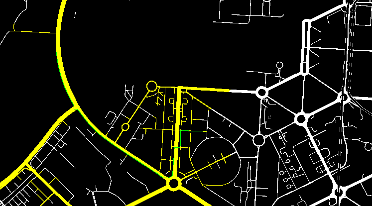
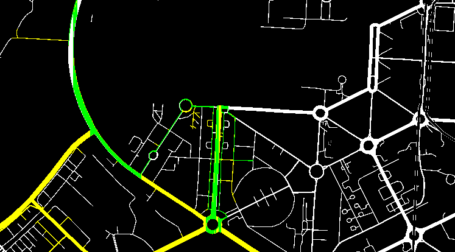

# BFS and DFS Pathfinding on a Map

This repository contains a Python program that demonstrates the implementation of Breadth-First Search (BFS) and Depth-First Search (DFS) algorithms for finding the shortest path between two points on a map. The program highlights the key differences between BFS and DFS in terms of how they explore the graph and the results they yield.

## Table of Contents

- [Project Overview](#project-overview)
- [Algorithms Used](#algorithms-used)
  - [Breadth-First Search (BFS)](#breadth-first-search-bfs)
  - [Depth-First Search (DFS)](#depth-first-search-dfs)
- [Requirements](#requirements)
- [How to Run](#how-to-run)
- [Demo](#demo)
- [Conclusion](#conclusion)
  
## Project Overview

This project aims to demonstrate how the BFS and DFS algorithms operate on a simple graph representing a map. The user can specify the start and end points, and the program will display the path found by each algorithm.

- **BFS (Breadth-First Search):** Finds the shortest path in an unweighted graph.
- **DFS (Depth-First Search):** Explores deeper paths first but doesn't guarantee the shortest path in an unweighted graph.

## Algorithms Used

### Breadth-First Search (BFS)

BFS is a level-order search algorithm that explores all nodes at the present depth before moving on to nodes at the next depth level. It is optimal for finding the shortest path in an unweighted graph because it visits nodes in the order of their distance from the source.

### Depth-First Search (DFS)

DFS explores as far along a branch as possible before backtracking. While DFS may not guarantee the shortest path, it is useful in scenarios where a complete exploration of paths is necessary. It tends to go deeper into one path before backtracking and exploring other paths.

## Requirements

- Python 3.x
- Libraries: 
  - `OpenCV` (for visualization and reading and writing images)
  - `NumPy` (for image operations)
  
## Conclusion
This project demonstrates the differences between BFS and DFS in terms of pathfinding and performance. BFS is guaranteed to find the shortest path in an unweighted graph, while DFS might not. However, DFS can be useful for exhaustive searches in certain scenarios.

Feel free to fork this repository, experiment with different map configurations, and contribute to improving the implementation!
